#Implementing the “Microsoft” Peering for ExpressRoute access to Office365 and CRM Online

1. Introduction
================
ExpressRoute allows customers to access Microsoft cloud services over dedicated connectivity, by establishing, in a highly automated way, peering relationships with the Microsoft network at selected “meet-me” locations. 

ExpressRoute provides access to Azure “private” services (i.e. resources deployed within an Azure Virtual Network), Azure “public” services (i.e. services exposed by the Azure platform over public, internet-accessible endpoints) and Office365/CRM Online services. To learn more about ExpressRoute fundamentals, you can refer to our [Azure documentation] (https://azure.microsoft.com/en-us/documentation/articles/expressroute-introduction/) on ExpressRoute. 

This document contains guidance and examples on how to configure ExpressRoute to access Office365 and CRM Online, i.e. on how to set up the [“Microsoft” peering] (https://azure.microsoft.com/en-us/documentation/articles/expressroute-circuit-peerings/#expressroute-routing-domains) in real-world scenarios. It is not a replacement for the official ExpressRoute documentation, which should be known and fully understood before reading this document. 

The document is structured as follows. 

The paragraph “ExpressRoute access to O365/CRMOL endpoints” explains how Office365 and CRM Online are accessed from a customer network over an ExpressRoute connection. The key message is that ExpressRoute provides an alternative routing path, over dedicated connectivity, to access the same O365/CRMOL endpoints that are exposed to (and reachable from) the internet. It also explains why, for customers that deploy ExpressRoute, internet access is still required to successfully consume O365/CRMOL services.

The paragraph “ER-friendly DNS resolution in globally distributed networks” describes the distributed architecture of Office365, and how it leverages a geoDNS service to redirect user requests to the nearest regional datacenter. The key message is that geoDNS must be taken into account when implementing ExpressRoute, because it drives the selection of the peering location(s) and/or the name resolution strategy in the customer’s network.

The next paragraph, “Bi-directional connectivity over the Microsoft peering”, describes the connections that are established between a customer’s network and the Microsoft network in both "full-cloud" and "hybrid" O365 scenarios. The key message is that the Microsoft peering must support bi-directional connectivity, i.e. connections established from the customer’s network to the Microsoft network and connections established from the Microsoft network to hosts in the customer’s network.  

The paragraph “Comments on routing and IP addressing requirements for the Microsoft peering” highlights the key aspects of the routing/IP addressing requirements that customer networks must meet in order to successfully exchange traffic with the Microsoft network. These requirements, along with the Office365 characteristics described in the previous paragraphs, drive the implmentation of the Microsoft peering, as discussed in the last two paragraphs.

The paragraph “Networks with private (RFC 1918) addressing schemes” describes how to implement the Microsoft peering in the common case that the customer network uses a private (RFC 1918) address space. This scenario is described first because it provides a convenient way to introduce a fundamental aspect of the Microsoft peering, i.e. the NAT (Network Address Translation) process that must be implemented in the customer’s network for delivering traffic to the Microsoft network. 

The last paragraph, “Multiple ER circuits: Suboptimal and asymmetric routing issues”, explains how to configure ExpressRoute when multiple circuits are used, which is usually the recommended architecture for globally distributed customer networks. The paragraph shows that the same NAT mechanisms introduced to deal with RFC 1918 addressing schemes on the customer side can efficiently address the suboptimal and asymmetric routing issues that arise with multiple circuits.

2. ExpressRoute access to O365/CRMOL endpoints
===============================================
When an ExpressRoute connection is established between a “meet-me” location and a customer network, clients in that network can route traffic to/from O365/CRMOL without using the internet. ExpressRoute provides a direct, dedicated path to reach O365/CRMOL endpoints. ExpressRoute does *not* provide dedicated endpoints for accessing those services, and therefore it does not impact/change the way FQDNs for O365/CRMOL endpoints (e.g. “outlook.office365.com”) are resolved within the customer’s network. 
This is shown in Figure 1. Customer A does not have ExpressRoute. Customer B has deployed ExpressRoute. Both customers need internet access to query the DNS service, and both resolve the FQDN “outlook.office365.com” to the same\[[1](notes/note1.md)\] IP address “1.2.3.4” (red path). Customer’s A network does not know any better route to “1.2.3.4” than its default route, and will send traffic destined to IP address “1.2.3.4” to the internet (yellow path). Customer’s B network has learned (via BGP announcements received by Microsoft over the Microsoft peering) a direct route to deliver traffic to the Microsoft network without traversing the internet (green path). However, both Customer A and Customer B establish a connection to the same endpoint.

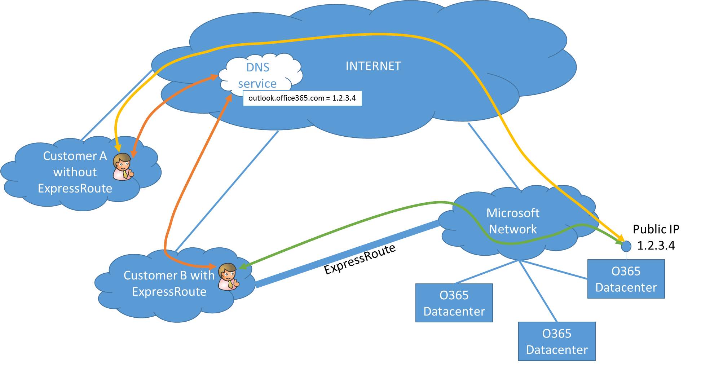
Figure 1. Both Customer A (without ExpressRoute) and Customer B (with ExpressRoute) establish a connection to the same O365/CRMOL endpoints.

2.1. ExpressRoute-able O365/CRMOL endpoints and internet access requirements
-----------------------------------------------------------------------
Not all O365/CRMOL endpoints are accessible over ExpressRoute, for the following two reasons:

1. not all O365 applications/features are currently supported over ExpressRoute. Please refer to [this article] (https://azure.microsoft.com/en-us/documentation/articles/expressroute-faqs/#expressroute-and-office-365-services-and-crm-online) for up-to-date information about supported O365 applications;

2. even for O365 applications supported over ExpressRoute, some content is served through Content Delivery Networks (CDNs) that can only be accessed over standard internet connectivity. Please refer to [this article] (https://support.office.com/en-us/article/Office-365-URLs-and-IP-address-ranges-8548a211-3fe7-47cb-abb1-355ea5aa88a2?ui=en-US&rs=en-US&ad=US) for up-to-date information about which O365 URLs which are accessible over ExpressRoute and which ones are not.

Therefore, Internet connectivity is still a mandatory prerequisite for customers planning to consume O365/CRMOL over ExpressRoute\[[2](notes/note2.md)\]. Figure 2 shows typical connections established by a client workstation in a customer network when consuming O365/CRMOL services over ExpressRoute. Some connections are routed over the internet; some others are routed over ExpressRoute. In the remainder of this document, O365/CRMOL endpoints that can be accessed over ExpressRoute will be referred to as “ExpressRoute-able”.

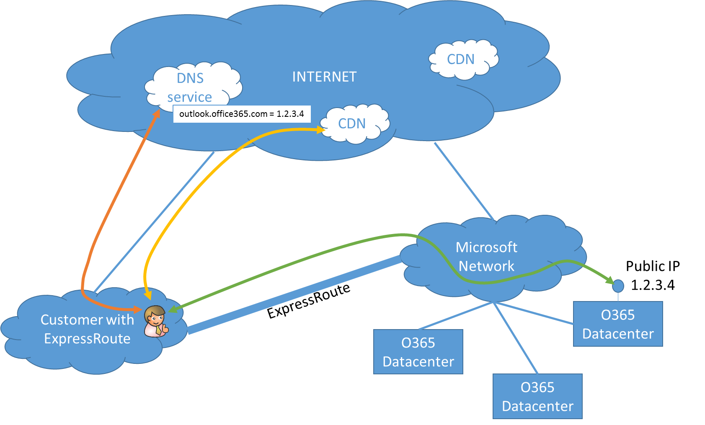  
Figure 2. A client workstation that accesses ExpressRoute-able O365 applications needs internet access in order to perform DNS resolution (red path) and to access content served by CDNs (yellow path).

2.2. Proxy configuration for ER access to O365
------------------------------------------
When consuming O365/CRMOL services, the best user experience is usually achieved bypassing the proxy. However, many customer organizations have established security policies that prohibit direct access to the internet from client workstations. By deploying ExpressRoute, these customers can avoid sending most of the O365/CRMOL traffic (i.e. all the connections to ExpressRoute-able endpoints) through the proxy, while remaining compliant to their security policies. Connections to non-ExpressRoute-able endpoints are the only ones sent through the proxy. 
This can be done (as shown in Figure 3) by properly configuring proxy exclusion lists on the client workstations, for example by means of Proxy Auto-Config (PAC) files. Guidance on how to create the exclusion list is provided in [this article] (https://support.office.com/en-us/article/Office-365-URLs-and-IP-address-ranges-8548a211-3fe7-47cb-abb1-355ea5aa88a2?ui=en-US&rs=en-US&ad=US), which, for each URL that must be accessible in order to successfully consume O365 services, indicates whether the associated IP addresses are ExpressRoute-able or not. In the example scenario of Figure 3, all the ExpressRoute-able URLs must be added to the proxy exclusion list.

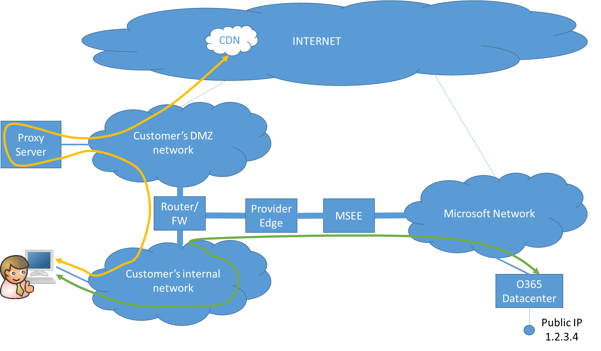  
Figure 3. Client workstation configured to bypass proxy for all ExpressRoute-able connections (green path). 

A PAC file that implements this proxing policy of figure 3 would have the following structure:
<pre><code>
function FindProxyForURL(url, host)
{
  /\* ExpressRoute-able URLs \*/
  if(shExpMatch(host, "outlook.office365.com")) { return "DIRECT"; }  
  if(shExpMatch(host, "\*.outlook.office.com")) { return "DIRECT"; }      
  …
  /\* Not ExpressRoute-able URLs go through the proxy \*/
  return "PROXY proxy:8080";   
}
</pre></code>

3. ER-friendly DNS resolution in globally distributed networks
============================================================
When users attempt to connect to Office 365, their computer’s DNS query determines the region of the world their computer is coming from, and Office 365 redirects the request to the nearest regional datacenter. Therefore, users in different geographical locations\[[3](notes/note3.md)\] will resolve the same FDQN to different IP addresses. This feature is usually referred to as “geoDNS”. GeoDNS must be taken into proper consideration when designing ExpressRoute solutions for customer networks that span multiple regions and have multiple internet breakouts. 
The example in Figure 4 illustrates the issue that may arise in these scenarios. A customer has a US-based O365 tenant, and their network spans multiple continents - it has a site in the US and a site in Europe. Both sites have their own internet breakout. As DNS resolution relies on internet connectivity, users in the US site and in the EU site will access the geoDNS service from different locations: each user will resolve the same URL “outlook.office365.com” to the IP address of the closest endpoint that can serve that URL (yellow path in the figure). The US-based user will resolve the URL to an IP address (1.2.3.4) located in the US datacenter; the EU-based user will resolve the same URL to an IP address (4.5.6.7) located in the EU datacenter. If only one ExpressRoute circuit is used (as shown in figure 4), and the BGP announcements\[[4](notes/note4.md)\] received by Microsoft over that circuit are propagated to all sites in the customer network, the EU-based user’s connection will be routed over a high-latency path (from EU to the US through the customer network, from the customer network to Microsoft over the US ExpressRoute circuit, and then back from the US to EU through the Microsoft network – red path in the figure). 

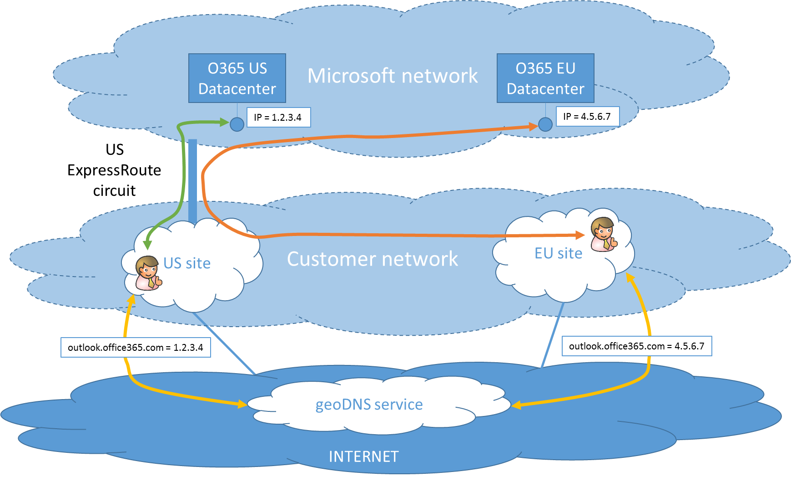  
Figure 4. Suboptimal routing issue for users resolving O365 FQDNs from sites geographically distant from the ExpressRoute circuit.

There are three ways to resolve this suboptimal routing problem. 

1. Avoid propagating O365 prefixes received from Microsoft over ExpressRoute to the EU site (or, more generally, to any sites that are geographically distant from the ExpressRoute circuit). Users in the EU site will access O365 over the internet.

2. Modify the DNS resolution policy in the customer’s network so that all DNS queries are routed through the internet breakout of the site to which the ExpressRoute circuit is attached. This can be done by acting on the DNS configuration itself or by proxy-ing the traffic from the EU site through a US-based proxy. This solution is shown in Figure 5.

3. Deploy ExpressRoute in the EU site. When a customer network peers with Microsoft over multiple ExpressRoute circuits, the routing policy must be carefully configured, as explained in section “Multiple ER circuits: Suboptimal and asymmetric routing issues”) later on this document. This is shown in Figure 6.

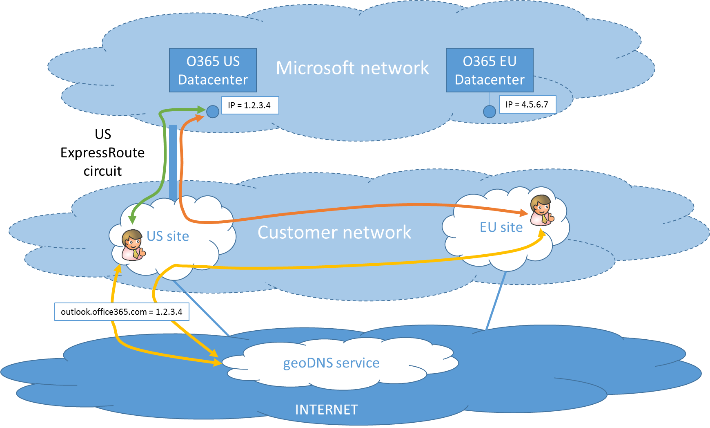 
Figure 5. The suboptimal routing problem described in Figure 4 can be solved by making sure that DNS queries (yellow path) are routed to the internet from the same site of the ExpressRoute circuit.

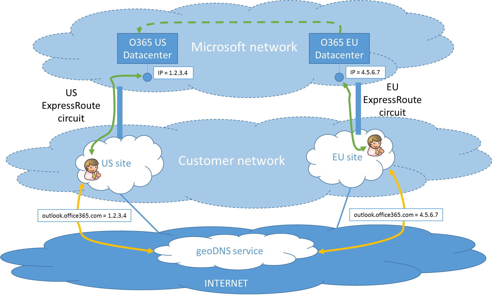  
Figure 6. The suboptimal routing problem described in Figure 4 can be solved by deploying a second ExpressRoute circuit. Please note that, if the customer’s tenant is located in the US datacenter, the connections initiated by EU users will be proxied to the US over the Microsoft backbone (dashed green path). 

4. Bi-directional connectivity over the “Microsoft” peering
=============================================================
The Microsoft peering supports bi-directional connectivity, i.e. connections established from the customer’s network to the Microsoft network and connections established from the Microsoft network to hosts in the customer’s network. The purpose and the characteristics of both types of connections are detailed below.

4.1. Connections from the customer’s network to O365/CRMOL endpoints
----------------------------------------------------------------------
These connections are initiated by clients in the customer’s network that access O365/CRMOL services through their browsers or Office client applications (such as Outlook). In this document, these connections will be referred to as “outbound connections” (i.e. the customer’s perspective is used).
Figure 7 shows an outbound TCP connection. The connection is initiated by the client in the customer’s network, which sends the first TCP SYN. When the TCP connection is established, traffic flows in both directions. 

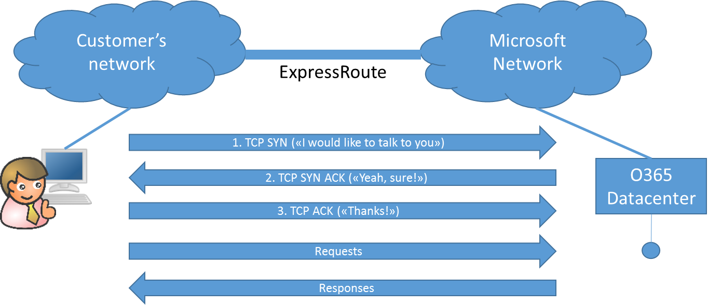  
Figure 7. A TCP/IP connection initiated by a client workstation in the customer network. From the customer’s perspective, this is an outbound connection. 

4.2. Connections from O365 to hosts in the customer’s network
---------------------------------------------------------------
These connections are required in some O365 [hybrid deployments] (https://support.office.com/en-us/article/Office-365-integration-with-on-premises-environments-263faf8d-aa21-428b-aed3-2021837a4b65). Typical examples include connections to on-premises ADFS or Exchange hosts that are initiated by O365 components. Different hybrid deployments may require different types of inbound connections; however, the usage of ExpressRoute (instead of internet connectivity) does not change the inbound connections that are needed, which only depend on the characteristics of the O365 hybrid architecture itself. In this document, these connections will be referred to as “inbound connections” (i.e. the customer’s perspective is used). 
Figure 8 shows an inbound TCP connection. The connection is initiated by an O365 component in the Microsoft network, which sends the first TCP SYN. When the TCP connection is established, traffic flows in both directions.

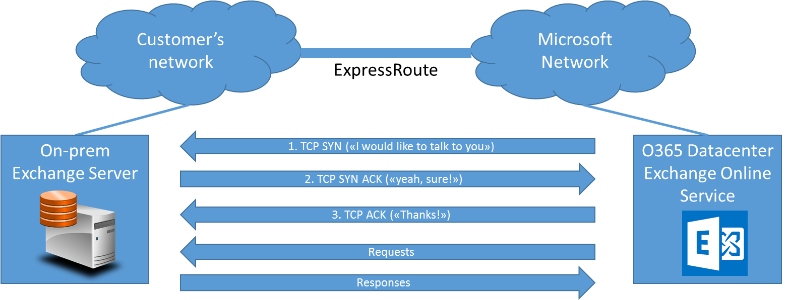  
Figure 8. A TCP/IP connection initiated by O365. From the customer’s perspective, this is an inbound connection. 

Please note that ExpressRoute customers with hybrid O365 deployments are not required to route inbound connections over their ExpressRoute circuit(s), even if ExpressRoute is used for outbound connections: routing outbound connections over ExpressRoute and inbound connections over the internet prevents customers from fully leveraging the benefits of ExpressRoute, but it is technically feasible and supported by Microsoft.

###4.2.1. How to understand if and when inbound connections are required
Customers planning to use ExpressRoute for O365/CRMOL need to identify which connections are required in their hybrid deployment.
Customers with existing hybrid deployments can do so by simply checking which on-premises server products (ADFS, Exchange Server, …) they are currently exposing over the internet. 
Customers planning brand new O365 hybrid deployments are advised to finalize their O365 design first and then derive their ExpressRoute requirements. Microsoft provides official documentation on [Office 365 integration with on-premises environments] (https://support.office.com/en-us/article/Office-365-integration-with-on-premises-environments-263faf8d-aa21-428b-aed3-2021837a4b65) which contains details about inbound connectivity requirements for each O365 application. Customers are advised to seek expert advice from Microsoft or qualified third parties when designing complex O365 hybrid scenarios.

5. Comments on routing and IP addressing requirements for the Microsoft peering
================================================================================
The requirements for the “Microsoft” peering are described in the official ExpressRoute documentation (see [IP addressing requirements](https://azure.microsoft.com/en-us/documentation/articles/expressroute-routing/#ip-addresses-for-peerings) and [routing requirements](https://azure.microsoft.com/en-us/documentation/articles/expressroute-routing/)). The following notes provide additional clarifications and answers to frequently asked questions.

The routes from Microsoft O365 are sent over to the customer’s network through the BGP session established between the customer/provider Edge and Microsoft Edge. The BGP session for the “Microsoft” peering requires public IPv4 addresses and a Public AS number from the customer.  This IPv4 address and AS Numbers are verified to be owned by the customer as part of the BGP session setup. When defining the set of public IPv4 addresses to use for the ExpressRoute Microsoft peering, customers are advised to review the [mandatory requirements](https://azure.microsoft.com/en-us/documentation/articles/expressroute-routing/#ip-addresses-for-peerings) about IRR registration and Autonomous System Numbers (ASN).   All IP datagrams exchanged between the customer’s network and the Microsoft network over the Microsoft peering must have a public IPv4 source address and a public IPv4 destination address. 

All O365/CRMOL endpoints have public IPv4 addresses owned and managed by Microsoft. 
Microsoft does not provide public IPv4 addresses to ExpressRoute customers. In order to send traffic to Microsoft and receive traffic from Microsoft, customers are required to procure their own IPv4 addresses. Customer can use NAT to translate their private IP range to a public IP for communicating with O365 resources over the ExpressRoute circuit. This is similar to using NAT when accessing the internet. Please note that the NAT IP addresses used for internet traffic must be different from the NAT IP addresses used in the Microsoft Peering. This is to ensure that only O365-related traffic (and not other traffic to public Microsoft resources like Windows Update) is routed though the ExpressRoute circuit. Please refer to section “Networks with private (RFC 1918) addressing schemes” for more information.

5.1. Customer responsibilities vs. provider responsibilities
-------------------------------------------------------------
In order to set up an ExpressRoute circuit, customers may work with one of the [official ExpressRoute Providers](https://azure.microsoft.com/en-us/documentation/articles/expressroute-locations/#connectivity-provider-locations), or with their carrier of choice and connect to ExpressRoute through an [aggregation partner](https://azure.microsoft.com/en-us/documentation/articles/expressroute-locations/#connectivity-through-service-providers-not-listed)’s exchange platform.
ExpressRoute providers may support one or more [deployment models](https://azure.microsoft.com/en-us/documentation/articles/expressroute-introduction/#how-can-i-connect-my-network-to-microsoft-using-expressroute) (“co-location at the cloud exchange”, “ethernet point-to-point”, “IPVPN any-to-any”). The deployment model defines who (customer or provider) is responsible for meeting the IP addressing requirements. More specifically:

- providers that offer ExpressRoute access based on the “co-location at the cloud exchange” or “ethernet point-to-point” models are not required to address routing and IP addressing requirements on behalf of their end customers. However, these providers may offer additional services, on top of their standard ExpressRoute offerings, to help customers meet these addressing/routing requirements. Customers that do not own a public ASN and an associated range of public IP addresses should check with their provider of choice the availability of such services;

- providers that offer ExpressRoute access based on the “IPVPN any-to-any” model must take care of routing and addressing requirements on behalf of their customers. 

6. Networks with private (RFC 1918) addressing schemes
=======================================================
This paragraph describes how to implement the Microsoft peering in customer networks that use private ([RFC 1918](https://www.google.co.in/url?sa=t&rct=j&q=&esrc=s&source=web&cd=5&cad=rja&uact=8&ved=0ahUKEwj_z_v7-KHLAhVoDZoKHWzrBLEQFggwMAQ&url=https%3A%2F%2Ftools.ietf.org%2Fhtml%2Frfc1918&usg=AFQjCNEo6IHs1jiKT3P4cA3kk89aQhJjmw)) addressing schemes. As discussed in the previous paragraph “Comments on routing and IP addressing requirements for the Microsoft peering”, only IP datagrams with both a public source address and a public destination address can be exchanged over this peering. Therefore, when an RFC 1918 addressing scheme is used in the customer’s network, proper NAT configuration is required to allow hosts with a private address to initiate outbound connections and to receive inbound connections. 
The required configuration for outbound connectivity and inbound connectivity is presented in the two following paragraphs.

6.1. Source-NAT for outbound connectivity
------------------------------------------
The mechanism whereby a host with a private IP address can initiate a connection to an O365/CRMOL endpoint over the Microsoft peering is Source Network Address Translation (Source-NAT). 
In order to discuss Source-NAT in the context of ExpressRoute connectivity, IP datagrams will be represented as shown in Figure 9. The layer-2 header and trailer are irrelevant for the purpose of this discussion and are omitted.

  
Figure 9. Representation of IP datagrams used in this document.

Figure 10 provides an example of the Source-NAT process for outbound connections established over the Microsoft peering. The customer’s network uses the address range 10.0.0.0/8. The customer has configured Source-NAT with the NAT pool 20.2.2.0/29 (IP addresses 20.2.2.0 – 20.2.2.7). When a client workstation with IP address 10.0.0.57 sends a request to the O365 endpoint, the IP datagram is routed through the ER link; properly configured routing devices on the customer/provider side must perform Source-NAT and replace the source IP address 10.0.0.57 with one of the IP addresses in the NAT pool (20.2.2.3 in the example). Response datagrams are subjected to a similar operation when they go through the NAT-ting device that Source-NATted the outbound datagrams: The Source-NAT address 20.2.2.3 is replaced with the original private address 10.0.0.57, so that the datagram can be routed back to the workstation that initiated the connection.

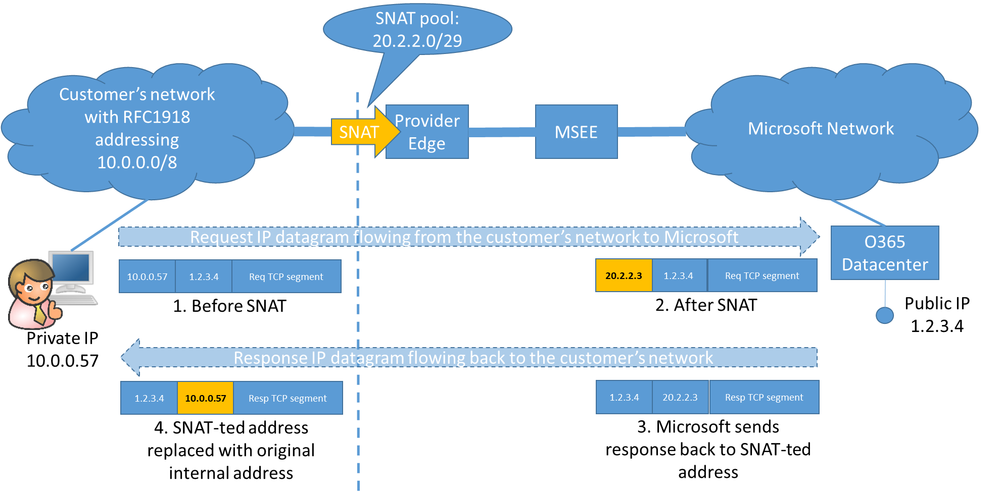  
Figure 10. Source-NAT for outbound connections. Example of customer network using RFC 1918 address range 10.0.0.0/8 and NAT pool 20.2.2.0/29.

As all the traffic delivered by the customer’s network to the Microsoft network over the ExpressRoute circuit will now have one of the IP addresses in the NAT pool as its source address, the NAT pool is the only prefix that routers in the Microsoft network need to learn from the customer’s network over the BGP session for the Microsoft peering. Therefore, the BGP speakers on the provider edge will only announce, in the “Microsoft” BGP session, the NAT pool (and the /30 network for the point-to-point link between the routing interfaces). Customers must specify these prefixes in the parameter “MicrosoftConfigAdvertisedPublicPrefixes” when configuring the Microsoft peering with “Add-AzureRmExpressRouteCircuitPeeringConfig”. Please refer to the [official documentation](https://azure.microsoft.com/en-us/documentation/articles/expressroute-howto-routing-arm/) for more information.
All Microsoft Express route circuits come with a second redundant link to provide high availability. So the secondary circuits also need a /30 address space to configure both ends of the Peer to peer routers between the provider edge and Microsoft Edge.
All the public IPv4 prefixes announced in the “Microsoft” BGP session must meet the IRR registration requirements officially documented [here](https://azure.microsoft.com/en-us/documentation/articles/expressroute-routing/#ip-addresses-for-peerings). 

###6.1.1. How to size the NAT pool 
The number of IP addresses needed to implement Source-NAT for outbound connections depends on the maximum number of concurrent users and on the O365/CRMOL applications being used. Microsoft provides official guidance for sizing the NAT pool in [this article](https://support.office.com/en-us/article/NAT-support-with-Office-365-170e96ea-d65d-4e51-acac-1de56abe39b9). 

6.2. Destination-NAT for inbound connectivity
---------------------------------------------
Inbound connections are initiated by O365 components that need to connect to hosts in the customer’s network. In order to make such hosts reachable from outside their network (either through ER or through the internet) customers must assign public IP addresses to them. Figure 11 shows how this can be done by defining a DMZ network with a public addressing scheme. With this approach, the servers that must be reached by O365 have public IP addresses configured on their NICs. Inbound connections can therefore be established directly to those servers. Please note that the public IP addresses assigned to servers that must be reached over ExpressRoute must be advertised in “Microsoft” BPG session, and must meet the IRR registration requirements officially documented [here](https://azure.microsoft.com/en-us/documentation/articles/expressroute-routing/#ip-addresses-for-peerings).

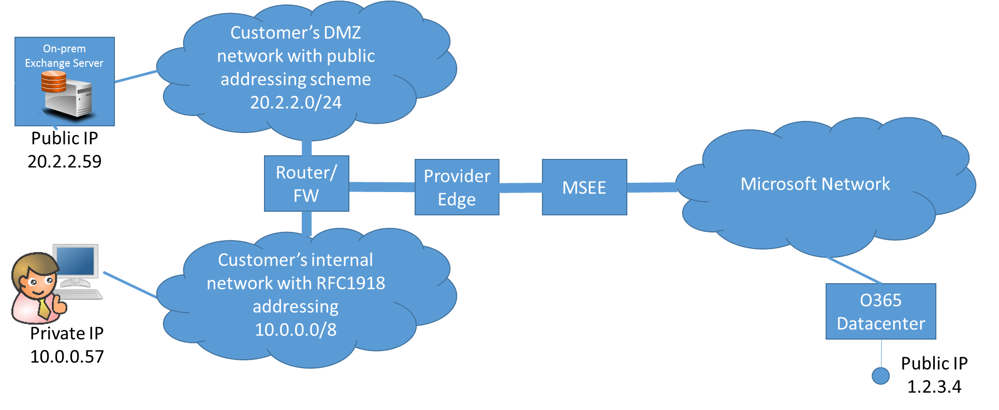  
Figure 11. DMZ network with public address range. O365 can initiate inbound connections to the DMZ hosts over ExpressRoute by using the hosts’ IP addresses.

Because of the scarcity of IPv4 addresses, many customers adopt a different approach, shown in Figure 12: A private, RFC 1918 address range is used for the DMZ network. In this case, all the hosts in the DMZ network have a private IP address and therefore cannot be directly reached by O365 over the “Microsoft” peering.

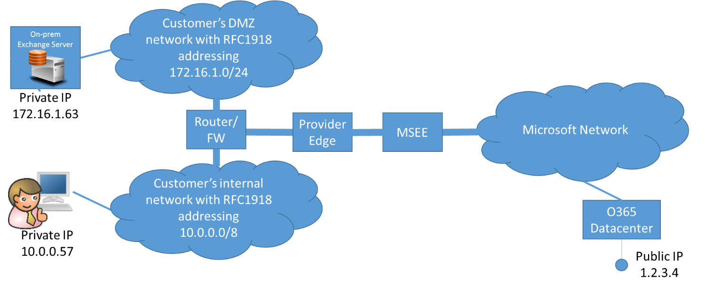  
Figure 12. DMZ network with private (RFC 1918) address range. The hosts in the DMZ network have a private IP address and therefore cannot be directly reached by O365 over the “Microsoft” peering.

In order to enable inbound connectivity in this case, the following additional configuration is required:

- a public IPv4 address must be assigned to each server to be reached by O365 over the Microsoft peering. The reserved IP addresses must meet the requirements officially documented [here](https://azure.microsoft.com/en-us/documentation/articles/expressroute-routing/#ip-addresses-for-peerings) for the “Microsoft peering”;

- "A" or "CNAME" DNS records must be added to the customer domain's zone file that map the FQDN of each server exposed to Microsoft over ExpressRoute to the public IPv4 address assigned to the host, because Microsoft will use the public DNS service to resolve the names of the on-premises hosts. Please note that, as a consequence, on-premises servers will be reached by Microsoft over ExpressRoute by using the same FQDN, and the same IP address, that would be used to access the server from the internet;  

- these IP addresses must be advertised in the “Microsoft” BGP peering session (see next paragraph “BGP configuration”);

- destination-NAT must be used to route inbound traffic sent to these IP addresses by O365 to the corresponding internal hosts.

Figure 13 describes the required Destination-NAT process. The customer’s hybrid deployment includes an Exchange Server with internal IP address 172.16.1.63 that must be reached by O365 over ExpressRoute. The customer reserves the public IPv4 address 20.2.2.29 for the Exchange server and configures the routing/firewalling devices on the provider/customer side with a static Destination-NAT rule that maps destination address 20.2.2.59 to destination address 172.16.1.63\[[5](notes/note5.md)\].
 
 
Figure 13. Destination-NAT process required to allow inbound connections to reach on-premises hosts with private RFC 1918 IP addresses. 

6.3. BGP configuration required on the customer side
-----------------------------------------------------
The Source- and Destination-NAT mechanisms described in the previous paragraphs hide the customer network’s addressing scheme behind the NAT addresses. More specifically:

- source-NAT for outbound connections hides the clients’ IP addresses behind the public IP addresses in the Source-NAT pool (Figure 10);

- destination-NAT for inbound connections hides each on-premises server behind the public IP address statically mapped to it (Figure 13).

As a result, the routers on the Microsoft network only need to learn routes to the public IP addresses involved in the two NAT processes. For the example network and the NAT configuration shown in Figure 10 and Figure 13, the BGP speakers on the provider edge must advertise:

- the prefix for the Source-NAT pool: 20.2.2.0/29;

- the IP address statically mapped to the on-premises Exchange Server: 20.2.2.59/32 (more /32 prefixes can be advertised if more servers are present in the hybrid scenario);

- the /30 network used on the point-to-point link between the provider edge and the MSEE (IP addresses not shown in the figures).

6.4. Internet reachability for on-premises servers
---------------------------------------------------
In most hybrid deployments, the on-premises servers must be reachable not only from the Microsoft network over the ExpressRoute link, but also from the internet (the obvious reason being that those servers must be accessible by users working outside of their corporate network). Therefore, routes to those servers must be announced to the internet, which creates the following problem: Microsoft routers will eventually learn two different routes to the on-premises servers, one over ExpressRoute, the other through the internet.
How can ExpressRoute customers ensure that Microsoft routers will always prefer the ExpressRoute path? This is achieved by leveraging the basic routing principle – which is also used by BGP’s route selection process – that most specific routes are always preferred: customers are required to announce to Microsoft prefixes that are more specific (longer subnet mask) than the prefixes they announce to the internet.
In the example scenario of Figure 13, this approach can be implemented as follows:

- reserve a block of IP addresses to be used to expose the on-premises servers that must be reached over the internet and ExpressRoute, for example 20.2.2.56/29 (which includes the IP assigned to the on-premises Exchange Server);

- announce the whole prefix 20.2.2.56/29 to the internet;

- announce 20.2.2.63/32 over the Microsoft BGP session (and additional /32 prefixes if more servers must be reached over ExpressRoute).

This approach is applicable both in the case of DMZ networks with private IP addresses (Figure 12) and in the case of DMZ networks with public IP addresses (Figure 11). In the latter case, the entire public range used in the DMZ can be advertised to the internet.

7. Multiple ER circuits: Suboptimal and asymmetric routing issues
==================================================================
Suboptimal and asymmetric routing issues may arise in globally distributed customer networks that peer with Microsoft over two (or more) ExpressRoute circuits. When multiple ExpressRoute circuits exist (and are configured to establish the “Microsoft” BGP sessions), multiple routing paths become available between the customer’s network and the Microsoft network.
Figure 14 shows an example of a customer network spanning Europe and the US, which peers with Microsoft over two ExpressRoute circuits, one in a EU peering location, and the other one in a US peering location. In this scenario, routing information is propagated between the customer’s network and the Microsoft network over the two circuits. As a consequence:

- routers in the customer’s network learn two paths that can be used to reach hosts in the Microsoft network – one path through the EU circuit and one path over the US circuit;

- similarly, routers in the Microsoft networks learn two paths that can be used to reach hosts in the customer’s network – one path through the EU circuit and one path over the US circuit.

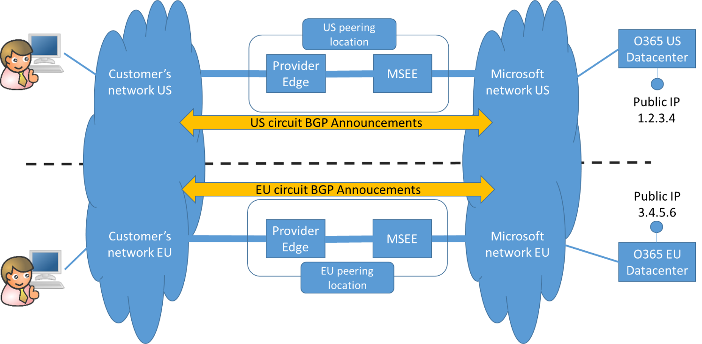 
Figure 14. A customer network spanning Europe and the US peers with Microsoft over two ExpressRoute circuits.

When multiple routing paths are available, routers on both networks must address the following problems:
1. optimal routing: when initiating a connection, select the best available path

2. symmetric routing: when sending traffic in response to a connection initiated by a host on the peer network, use the same path as the request traffic 

It is important to understand how these problems affect inbound and outbound connections:

- for outbound connections, the customer’s routers must select the optimal path and the Microsoft routers must ensure symmetric routing;

- for inbound connections, the Microsoft routers must select the optimal path and the customer’s routers must ensure symmetric routing.

These problems and their respective solutions are discussed in the following paragraphs.

7.1. The suboptimal routing problem
------------------------------------
An example of the suboptimal routing problem is illustrated in Figure 15. US-based clients access US and EU endpoints over the US circuit. Traffic from the US to the EU endpoints is routed over the Microsoft backbone (green path). However, EU-based users also access the Microsoft network over the US circuit. When these users need to reach an EU endpoint, their traffic is routed in a suboptimal way: the traffic goes from the EU client to the US ExpressRoute peering location over the customer’s network, enters the Microsoft network though the US ExpressRoute circuit, and is finally routed back to the EU endpoint over the Microsoft network (red path).   

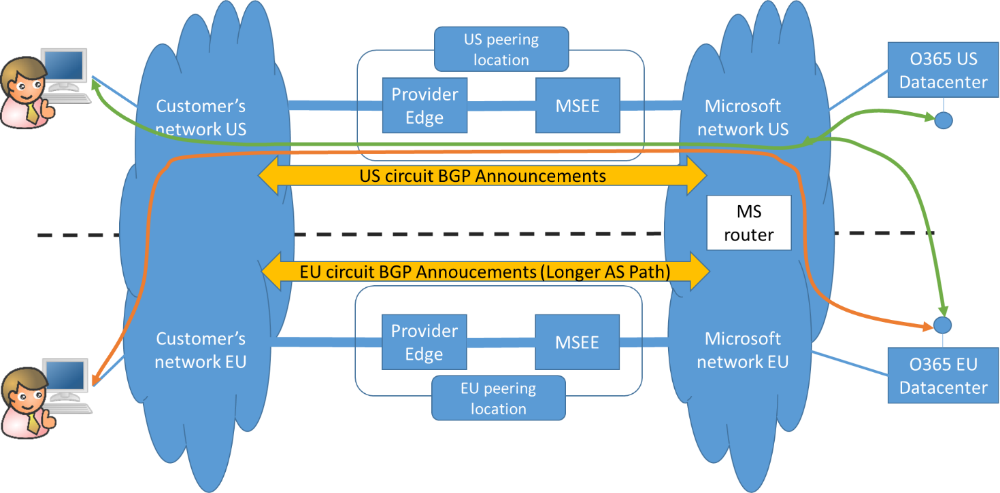  
Figure 15. Example of suboptimal routing for EU-based users accessing EU-based endpoints.

The suboptimal routing issue described in Figure 15 affects all the scenarios where the two ExpressRoute circuits are configured in an active/passive fashion. Active/passive behavior is obtained by tweaking the BGP configuration on the provider side (BGP Local Preference for outbound routing and AS Path Prepending for inbound routing).

7.2. The asymmetric routing problem
------------------------------------
The asymmetric routing problem is depicted in Figure 16. A US-based client initiates a connection to an O365 endpoint. The outbound traffic is routed through the US ExpressRoute circuit (green path). However, the response traffic from O365 is routed through the EU circuit, and then back from the EU to the US client over the customer’s network (red path).  

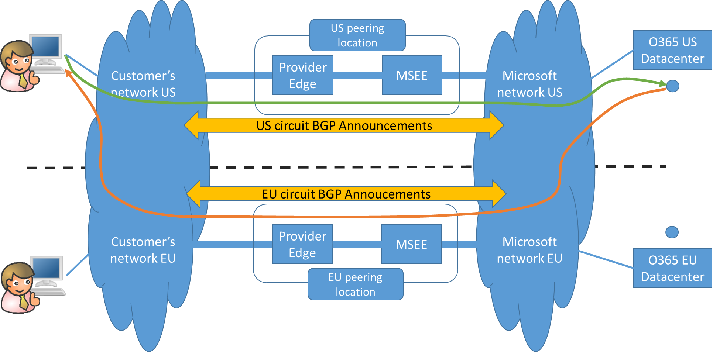  
Figure 16. Example of asymmetrically routed connection between a US-based client and a US O365 endpoint.

On top of the potential negative impact on the round-trip latency, asymmetrically-routed connections should be avoided because they might be dropped if they traverse, on the return path, stateful firewalling devices. 
Asymmetric routing is always possible in the scenario of Figure 15 and Figure 16. Irrespective of the circuit that is used to initiate the outbound connection (which customers might control through their outbound routing policies), the return traffic might be sent by Microsoft over the EU circuit or the US circuit. The circuit is selected according to Microsoft’s ECMP (Equal Cost Multi Path) routing policy, which will load balance the traffic across the two circuits. 
As described in the previous paragraph, configuring the two circuits in active/passive mode, which would cause Microsoft to stop load balancing traffic between them, introduces suboptimal routing issues. Therefore, it is not a good solution. 
The following paragraphs explain how to solve both suboptimal and asymmetric routing issues when multiple ExpressRoute circuits are used. Outbound connectivity is examined first. Similar solutions can be used to for inbound connectivity, which is discussed next. 

7.3. Outbound connectivity: Achieving optimal and symmetric routing
--------------------------------------------------------------------
The configuration for outbound connectivity that avoids the suboptimal and asymmetric routing when multiple circuits are present will be discussed in the example scenario of Figure 14, Figure 15 and Figure 16, which is general enough to cover most practical cases.

###7.3.1. Optimal routing for outbound connectivity
In order to achieve optimal performance, customers must implement a proper outbound routing policy, i.e. make sure that traffic going from their network to Microsoft is routed through the optimal path. 
There are two “optimal” outbound routing policies.

1. Outbound connections initiated by US-based clients always go through the US circuit and outbound connections initiated by EU-based clients always go through the EU circuit. From the customer’s perspective, this is a “hot potato” approach whereby traffic is delivered to Microsoft as soon as possible. This would be the preferred policy if the US??EU latency is higher in the customer’s network than in the Microsoft network.

2. Outbound connections to US o365/CRMOL endpoints always go through the US circuit and outbound connections to EU endpoints always go through the EU circuit. From the customer’s perspective, this is a “cold potato” approach whereby traffic is delivered to Microsoft as late as possible. This would be the preferred policy if the US??EU latency is higher in the Microsoft network than in the customer’s network.

The two policies described above are “optimal” in the sense that they avoid suboptimal routing decisions such as the one depicted in Figure 15 (i.e. EU users routing traffic to EU endpoints over the US circuit and US users routing traffic to US endpoints over the EU circuit).

The “hot potato” approach (1) can be implemented by customers by proper BGP configuration (Local Pref attributes) and/or IGP metrics. The “cold potato” approach (2) requires explicit support by Microsoft: Routers in the customer’s network must know which prefixes learnt from Microsoft BGP speakers belong to which locations. This is exactly one of the reasons why Microsoft introduced support for BGP Communities, as officially documented [here](https://azure.microsoft.com/en-us/documentation/articles/expressroute-routing/#support-for-bgp-communities-coming-soon).

###7.3.2. Symmetric routing for outbound connectivity
Symmetric routing for outbound connections is achieved by making sure that routers in the Microsoft network can always identify, when they route return traffic back to the customer’s network, which ExpressRoute circuit was used to initiate the connection. This is achieved by using different pools of source IP addresses to initiate connections over the two circuits. The source-NAT mechanism described in paragraph “Source-NAT for outbound connectivity” can therefore be used to address the asymmetric routing problem: Using different NAT pools for each ExpressRoute circuit enables routers in the Microsoft network to identify the circuit used by the client to initiate the connection. 
Figure 17 shows how this strategy can be used to eliminate the asymmetric routing issue in the example scenario. Two different NAT pools (20.2.2.0/29 for the US circuit and 20.2.2.8/29 for the EU circuit) are defined and advertised to Microsoft in the BGP sessions for the two circuits. Microsoft routers learn two different routes to the customer’s network: a route to 20.2.2.0/29 through the US circuit; and a route to 20.2.2.8/29 through the EU circuit. All outbound connections initiated over the US circuit will have a source address belonging to the US NAT pool 20.2.2.0/29: response traffic will always go through the US circuit. Similarly, all outbound connections initiated over the EU circuit will have a source address belonging to the EU NAT pool 20.2.2.8/29: response traffic will always go through the EU circuit.

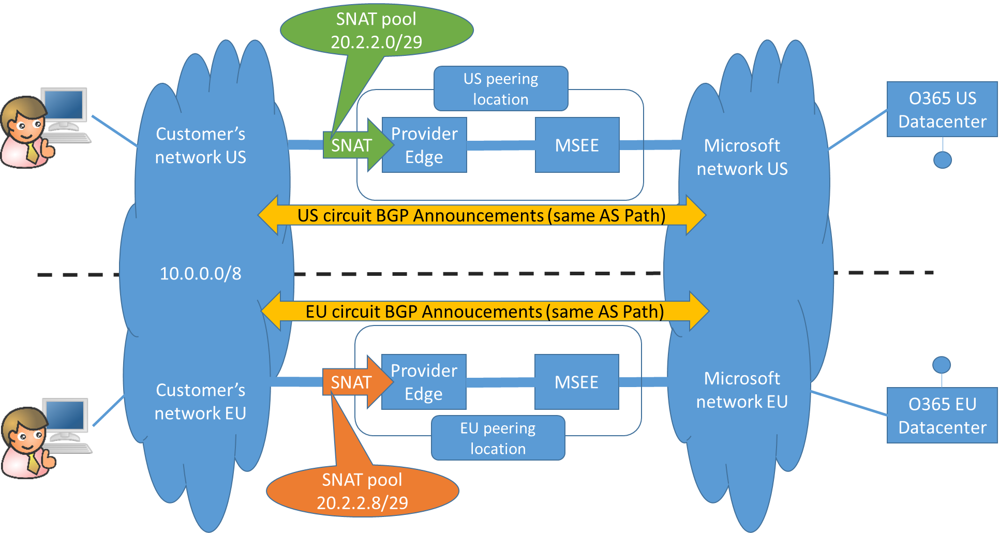  
Figure 17. Source-NATting outbound connections with different, non-overlapping NAT pools for each circuit addresses both asymmetric routing and suboptimal routing issues when globally distributed networks peer with Microsoft over multiple ExpressRoute circuits.

7.4. Inbound connectivity: Achieving optimal and symmetric routing
-------------------------------------------------------------------
Inbound connections are initiated by O365 components that need to access hosts in the customer’s network (see Figure 8). 

###7.4.1. Optimal routing for inbound connectivity
When multiple ExpressRoute circuits are used, customers are responsible for ensuring that inbound connections are initiated over a circuit that does not lead to suboptimal routing.
Figure 18 shows the example scenario that will be used to examine the problem. The situation is logically similar to the outbound connectivity case; there are however two important differences:

1. ExpressRoute does not allow customers (as of today) to send BGP community attributes which might be used to influence Microsoft’s outbound routing policies;

2. the customer knows and controls the physical location of the hosts that must be reached through inbound connections.

  
Figure 18. Example scenario for discussing optimal routing for inbound connectivity.

Because of (1), the only BPG mechanisms customers can leverage to influence the routing decisions on the Microsoft side is AS Path Prepending; because of (2), customers can advertise longer AS Paths on the BGP sessions for the circuit which is “far away” from the on-premises host. This will ensure that suboptimal paths (e.g. a US-hosted O365 component connecting to the on-premises host over the EU circuit) are avoided.

###7.4.2 Symmetric routing for inbound connectivity
The asymmetric routing problem for inbound connectivity is identical to the outbound case. The only difference is that for inbound connections the routers in the customer’s network are responsible for sending response traffic over the same circuit that was used by O365 to initiate the connection. However, the solution stays the same: inbound connections initiated over different ExpressRoute circuits must be Source-NATted behind different, non-overlapping NAT pools. This allows routers in the customer network to send response traffic through the same circuit used to initiate the connection.
Source-NATting for inbound connections must be implemented by customers after traffic is delivered to their network at the provider edge. The NAT pool can be carved out of the customer’s IP address range.
Figure 19 shows how Source-NAT must be implemented in the example scenario to avoid asymmetric routing issues for both outbound and inbound connectivity.

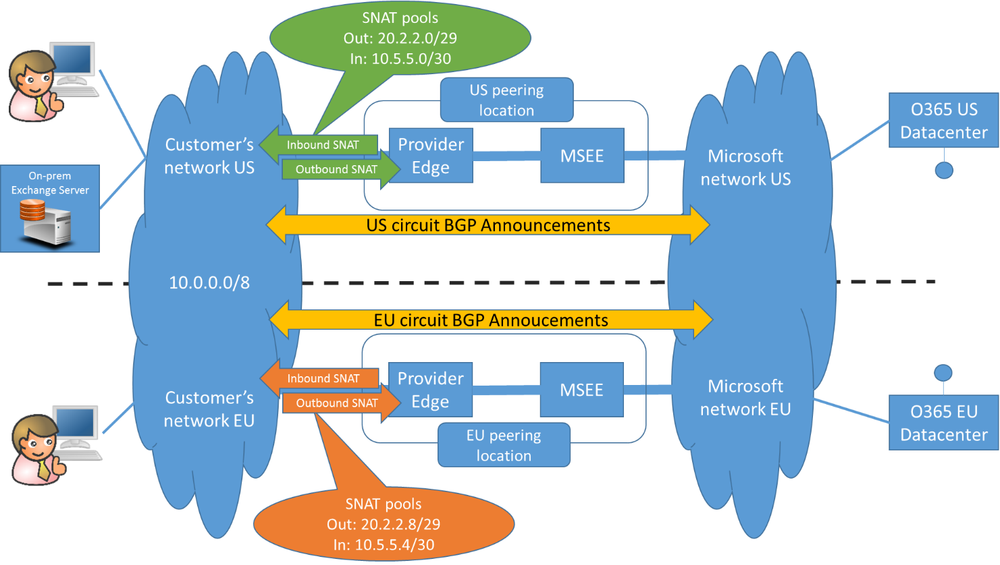  
Figure 19. Source-NAT configuration required to avoid asymmetric routing issues for both outbound and inbound connections.

###7.4.3. Destination-NAT for networks using private (RFC 1918) addressing schemes
As discussed in the paragraph “Destination-NAT for inbound connectivity”, inbound connectivity requires some additional Destination-NAT configuration if the customer uses RFC 1918 IP addresses in their DMZ network. Figure 20 adds Destination-NAT to the solution for optimal and symmetric inbound and outbound connectivity that has been discussed in this paragraph. Outbound connections initiated by O365 clients are Source-NATted behind a public NAT pool. Inbound connections are Destination-NATted and also Source-NATted behind a private pool (which can be carved out of the private 10.0.0.0/8 address space used by the customer network).

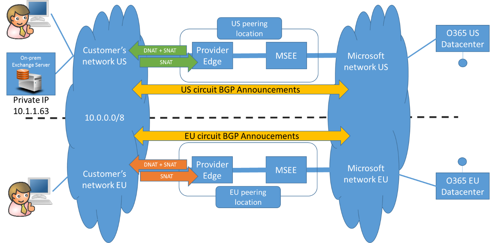  
Figure 20. The full solution supporting both inbound and outbound connectivity for customer networks based on RFC 1918 addressing schemes.
